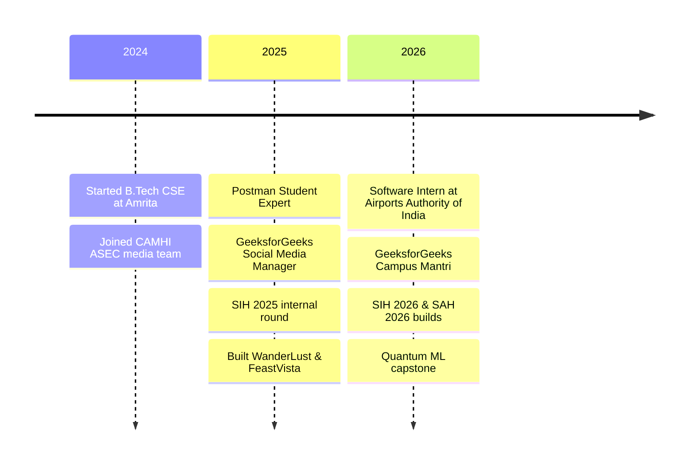

 

    

> [!IMPORTANT]
> **🟢 Open to SDE, Full-Stack and AI/ML internships.** I build complete products, from the database and APIs to the interface people actually use.

<table>
<tr>
<td width="56%" valign="top">

I'm a **Computer Science undergrad at Amrita Vishwa Vidyapeetham, Chennai** who loves turning ideas into software people use.

- 🏢 Built an **IT asset dashboard** for the **Airports Authority of India**
- 🏡 Shipped a **full-stack rental marketplace** with maps, auth and uploads
- 🧠 Building **AI projects**: RAG, satellite imagery and quantum ML
- 🧑‍🤝‍🧑 **GeeksforGeeks Campus Mantri** for my campus
- 🔁 `build → test → break → debug → improve → repeat`

</td>
<td width="44%" valign="top" align="center">

</td>
</tr>
</table>

<table>
<tr><td width="170"><b>💻 Languages</b></td><td>   </td></tr>
<tr><td width="170"><b>🎨 Frontend</b></td><td>     </td></tr>
<tr><td width="170"><b>⚙️ Backend</b></td><td>   </td></tr>
<tr><td width="170"><b>🗄️ Databases</b></td><td> </td></tr>
<tr><td width="170"><b>☁️ Cloud & APIs</b></td><td>  </td></tr>
<tr><td width="170"><b>🧰 Tools</b></td><td>     </td></tr>
</table>

Currently exploring:  

<table>
<tr>
<td width="100%">

- Designed and built an **inventory dashboard for IT asset oversight** (hardware, peripherals, software licenses)
- Implemented full **CRUD operations** on a SQL backend with optimized relational schemas
- Added **search and filtering** so staff can find any asset in seconds

     

</td>
</tr>
</table>

<table>
<tr>
<td align="center" width="33%">🧑‍🤝‍🧑 <b>Campus Mantri</b> GeeksforGeeks Campus Body </td>
<td align="center" width="33%">📱 <b>Social Media Manager</b> GeeksforGeeks Campus Body </td>
<td align="center" width="33%">🎬 <b>Media Team Member</b> CAMHI ASEC </td>
</tr>
</table>

Tap a button to open the live demo or code

<table>
<tr>
<td width="50%" valign="top">

Browse, create, edit and review property listings on an end-to-end rental marketplace.

     

 

</td>
<td width="50%" valign="top">

One storefront to order food and book a restaurant table, built with no UI libraries for a fast first paint.

  

  

</td>
</tr>
<tr>
<td width="50%" valign="top">

A single source of truth for IT hardware, peripherals and software licenses at AAI Chennai.

     

</td>
<td width="50%" valign="top">

20+ classic algorithms implemented in clean C, organized week by week with notes (31 commits).

 

</td>
</tr>
</table>

Work in progress

<table>
<tr>
<td width="50%" valign="top">

Disaster-management AI that spots oil spills at sea and traces them back to ships.

</td>
<td width="50%" valign="top">

A RAG system that answers questions from Indian scriptures without making things up.

</td>
</tr>
<tr>
<td width="50%" valign="top">

Can quantum machine learning compete on a real financial task? This benchmark finds out.

</td>
<td width="50%" valign="top">

An AI-driven app connecting India's artisans with buyers.

</td>
</tr>
</table>

<b>🛍️ More front-end builds</b> (Amazon clone, Flipkart UI)

 

| Project | What it is | Links |
|:--|:--|:--|
| **Amazon Homepage Clone** | Home, cart and sign-in pages with navigation, product sections, banners and hover effects | [Code](https://github.com/Chetan-Kumar-G/Amazon) |
| **Flipkart UI** | E-commerce layout practice in HTML & CSS | [Code](https://github.com/Chetan-Kumar-G/Flipkart) |

<table>
<tr>
<td align="center" width="25%">🎓 <b>9.11 CGPA</b> B.Tech CSE</td>
<td align="center" width="25%">🧩 <b>450+ problems</b> on LeetCode</td>
<td align="center" width="25%">🏁 <b>SIH 2025</b> Internal round selection</td>
<td align="center" width="25%">📮 <b>Postman</b> Student Expert (2025)</td>
</tr>
<tr>
<td align="center">☁️ <b>Google Cloud</b> Skills cert + Arcade</td>
<td align="center">🍃 <b>MongoDB</b> Core Concepts (2026)</td>
<td align="center">💡 <b>Microsoft Learn</b> Student Ambassador training</td>
<td align="center">📈 <b>IIT Madras</b> E-Auction Strategy competition</td>
</tr>
</table>

