# Chetan Kumar G

### Full-Stack Developer · AI Engineer · Product Builder

B.Tech Computer Science & Engineering @ **Amrita Vishwa Vidyapeetham, Chennai** &nbsp;|&nbsp; 📍 Chennai, India

**[🌐 Portfolio](https://chetankumarg.tech)** &nbsp;·&nbsp; **[📄 Resume](https://chetankumarg.tech/resume.pdf)** &nbsp;·&nbsp; **[✉️ Email](mailto:chetankumarg210307@gmail.com)** &nbsp;·&nbsp; **[💼 LinkedIn](https://www.linkedin.com/in/chetan-kumar-g21/)** &nbsp;·&nbsp; **[🧩 LeetCode](https://leetcode.com/u/Chetan_Kumar_G/)**

> [!IMPORTANT]
> **Open to SDE, Full-Stack and AI/ML internships.** I build complete products, from database and APIs to the interface people actually use, and I'm looking for a team where I can own real features.

| 🎓 **9.11** | 🧩 **450+** | 💼 **1** | 🚀 **10** | 📜 **13** | 🏆 **2** |
|:--:|:--:|:--:|:--:|:--:|:--:|
| CGPA | LeetCode problems solved | Software internship (AAI) | Projects built | Certifications & badges | Hackathons (SIH, SAH) |

---

## 👋 About Me

I'm a Computer Science undergraduate who loves turning ideas into working software. I've shipped an **internal asset-management dashboard for the Airports Authority of India**, built a **full-stack rental marketplace with maps and image uploads**, and I'm now working on **AI projects**: a RAG system over Indian scriptures, oil-spill detection from satellite imagery, and quantum machine learning for credit risk.

My loop: **build → test → break → debug → improve → repeat.**

---

## 💼 Experience

### Software Development Intern · Airports Authority of India (AAI), Chennai
*May 2026 – June 2026*

- Designed and built an **inventory dashboard for IT asset oversight** at AAI Chennai (hardware, peripherals and software licenses).
- Implemented full **CRUD operations** on a SQL backend with optimized relational schemas.
- Added **search and filtering** so staff can find any asset quickly.
- **Stack:** React.js · Vite · Node.js · Express.js · MySQL · Tailwind CSS

### Leadership & Community

| Role | Organization | Since |
|:--|:--|:--|
| **Campus Mantri** | GeeksforGeeks Campus Body | Jun 2026 |
| **Social Media Manager** | GeeksforGeeks Campus Body | Jun 2025 |
| **Media Team Member** | CAMHI ASEC | Oct 2024 |

---

## 🚀 Projects at a Glance

| Project | What it is | Tech | Status | Links |
|:--|:--|:--|:--:|:--|
| **AAI IT Asset Management** | Enterprise asset registry for Airports Authority of India | React · Node · Express · MySQL | ✅ Delivered | Internal tool |
| **WanderLust** | Full-stack vacation rental marketplace | Node · Express · MongoDB · Mapbox · Cloudinary | ✅ Live | [Live demo](https://wanderlust-qqct.onrender.com/listings) |
| **FeastVista** | Food ordering + restaurant table booking storefront | JavaScript · HTML · CSS | ✅ Live | [Live demo](https://chetan-kumar-g.github.io/FeastVista/) · [Code](https://github.com/Chetan-Kumar-G/FeastV) |
| **OceanGuard** | Oil-spill detection from satellite imagery + AIS ship data | AI · Remote sensing | 🔨 In progress | Smart India Hackathon 2026 |
| **Sanatan AI** | Evidence-grounded RAG over Indian scriptures | Python · LLMs · RAG | 🔨 In progress | Smart Amrita Hackathon 2026 |
| **Quantum Credit Risk** | Hybrid quantum-classical ML for credit scoring | Python · Quantum ML | 🔨 In progress | Capstone research |
| **Karigar** | AI market linkage & cataloguing app for artisans | AI · Mobile | 🔨 In progress | Smart India Hackathon 2026 |
| **Design & Analysis of Algorithms** | 20+ classic algorithms implemented in C, with notes | C | ✅ Done | [Code](https://github.com/Chetan-Kumar-G/Design-Analysis-and-Algorithms) |
| **Amazon Homepage Clone** | Multi-page e-commerce UI clone | HTML · CSS · JavaScript | ✅ Done | [Code](https://github.com/Chetan-Kumar-G/Amazon) |
| **Flipkart UI** | E-commerce layout practice | HTML · CSS | ✅ Done | [Code](https://github.com/Chetan-Kumar-G/Flipkart) |

---

## 🔍 Project Details

### 🏢 AAI IT Asset Management System
**Enterprise internal tool · built during my internship at Airports Authority of India**

> **Problem:** IT teams needed one reliable place to track hardware, peripherals and software licenses across the office.
>
> **What I built:** A dashboard where staff can add, update, search, filter and remove assets, backed by a relational SQL database with optimized schemas.
>
> **Tech:** React.js · Vite · Node.js · Express.js · MySQL · Tailwind CSS

### 🏡 WanderLust · Full-Stack Rental Platform
**[🔗 Live demo](https://wanderlust-qqct.onrender.com/listings)**

> **Problem:** Travellers need to discover stays, and hosts need a simple way to list them.
>
> **What I built:** An end-to-end rental marketplace where users can browse, create, edit and manage property listings and leave reviews.
> - Session-based **authentication** (Passport.js)
> - **Image uploads** processed and stored with Cloudinary
> - **Interactive maps** and geospatial listing locations with Mapbox
> - **RESTful APIs** with MongoDB persistence and a responsive Bootstrap UI
>
> **Tech:** Node.js · Express.js · MongoDB · Passport.js · Mapbox GL · Cloudinary · Bootstrap

### 🍽️ FeastVista · Food Ordering + Table Booking
**[🔗 Live demo](https://chetan-kumar-g.github.io/FeastVista/) · [💻 Code](https://github.com/Chetan-Kumar-G/FeastV)**

> **Problem:** Ordering food and booking a restaurant table usually take two different apps.
>
> **What I built:** A zero-dependency storefront that does both.
> - **7 menu categories**: beverages, desserts, fast food, rice, sabji, specials, sweets
> - **Reactive cart** with quantity controls, dynamic discounts and automatic bill calculation
> - **Restaurant pages** with a **table-booking flow**, account page and a support chat page
> - Built with **no UI libraries** at all, for a fast first paint
>
> **Tech:** JavaScript (ES6+) · HTML5 · CSS Grid / Flexbox · client-side state management

### 🌊 OceanGuard · *Smart India Hackathon 2026 (SIH26143)*

> **Problem:** Oil spills at sea are detected late, and the ship responsible is hard to identify.
>
> **What we're building:** A system that detects oil spills in **satellite imagery** and cross-checks them against **AIS ship-tracking data** to flag the vessel likely responsible.
>
> **Theme:** Disaster Management · **Status:** 🔨 In progress

### 🕉️ Sanatan AI · *Smart Amrita Hackathon 2026, Track T10*

> **Problem:** AI chatbots often invent answers when asked about scripture.
>
> **What I'm building:** An **evidence-grounded RAG system** that answers questions from the **Bhagavad Gita, Yoga Sutras and Upanishads** and cites the verses it used.
>
> **Theme:** Social Innovation, Inclusive & Educational Technology · **Status:** 🔨 In progress

### ⚛️ Quantum Machine Learning for Credit Risk · *Capstone*

> **Problem:** Can quantum machine learning compete with classical models on a real financial task?
>
> **What I'm building:** A **hybrid quantum-classical benchmark** that assesses borrower creditworthiness on the **UCI German Credit dataset**.
>
> **Status:** 🔨 In progress

### 🧵 Karigar · *Smart India Hackathon 2026 (SIH26090)*

> **Problem:** Skilled artisans struggle to reach buyers and list their products online.
>
> **What we're building:** An **AI-driven mobile app** for market linkage and smart product cataloguing.
>
> **Theme:** Heritage & Culture · **Status:** 🔨 In progress

### 🧮 Design & Analysis of Algorithms
**[💻 Code](https://github.com/Chetan-Kumar-G/Design-Analysis-and-Algorithms)**

> Clean C implementations with notes and complexity tables, organized week by week (31 commits).
> - **Sorting:** Bubble, Insertion, Merge, Quick, Heap, Counting, Radix
> - **Paradigms:** Divide & Conquer, Dynamic Programming (Knapsack, LCS, Matrix Chain), Greedy (Activity Selection, Huffman, MST)
> - **Graphs:** BFS, DFS, Dijkstra, Bellman–Ford, Floyd–Warshall, Topological Sort
> - **Theory:** Big-O / Θ / Ω analysis, P vs NP, reductions

### 🛒 Amazon Homepage Clone · 🛍️ Flipkart UI
**[💻 Amazon code](https://github.com/Chetan-Kumar-G/Amazon) · [💻 Flipkart code](https://github.com/Chetan-Kumar-G/Flipkart)**

> Front-end clones built to master layout and UI detail. The Amazon clone has **home, cart and sign-in pages**, with navigation, product sections, banners, a footer and hover interactions.

---

## 🛠️ Tech Stack

| Area | Tools |
|:--|:--|
| **Languages** | C · JavaScript (ES6+) · Python · Java |
| **Frontend** | React.js · Vite · HTML5 · CSS3 (Grid, Flexbox) · Tailwind CSS · Bootstrap |
| **Backend** | Node.js · Express.js · REST APIs · Passport.js |
| **Databases** | MongoDB · MySQL |
| **AI / ML** | RAG pipelines · Quantum ML · Satellite image analysis |
| **Cloud & APIs** | Google Cloud Platform · Mapbox GL · Cloudinary |
| **Tools** | Git · GitHub · Postman · VS Code · Figma · Canva |

---

## 🏆 Achievements & Certifications

- 🎓 **9.11 CGPA** in B.Tech CSE (12th: 94% · 10th: 91.2%)
- 🧩 **450+ problems solved** on [LeetCode](https://leetcode.com/u/Chetan_Kumar_G/)
- 💼 Completed a **Software Development Internship at Airports Authority of India** (2026)
- 🏁 **Smart India Hackathon 2025**: selected in the internal college screening round
- 🧑‍🤝‍🧑 **GeeksforGeeks Campus Mantri**, leading the campus coding community
- 📮 **Postman Student Expert** (2025)
- ☁️ **Google Cloud Skills** certification, and selected for **Google Cloud Arcade** challenges
- 🍃 **MongoDB Overview:** Core Concepts and Architecture (2026)
- 💡 **Microsoft Learn Student Ambassador** training
- 📈 **E-Auction Strategy Competition** participant (in collaboration with IIT Madras)
- 📚 13 certifications and badges in total, from **MongoDB, Google Cloud and IBM**

---

## 🗺️ My Journey

```mermaid
timeline
    title Chetan's journey so far
    2024 : Started B.Tech CSE at Amrita Vishwa Vidyapeetham
         : Joined CAMHI ASEC media team
    2025 : Postman Student Expert
         : GeeksforGeeks Social Media Manager
         : SIH 2025 internal round selection
         : Built WanderLust and FeastVista
    2026 : Software Intern at Airports Authority of India
         : GeeksforGeeks Campus Mantri
         : SIH 2026 (OceanGuard, Karigar) and SAH 2026 (Sanatan AI)
         : Quantum ML capstone
```

---

## 📬 Let's Build Something

I'm open to **internships and SDE roles**. The fastest way to reach me is email.

**[✉️ chetankumarg210307@gmail.com](mailto:chetankumarg210307@gmail.com)** &nbsp;·&nbsp; **[🌐 chetankumarg.tech](https://chetankumarg.tech)** &nbsp;·&nbsp; **[💼 LinkedIn](https://www.linkedin.com/in/chetan-kumar-g21/)** &nbsp;·&nbsp; **[📄 Resume](https://chetankumarg.tech/resume.pdf)**

