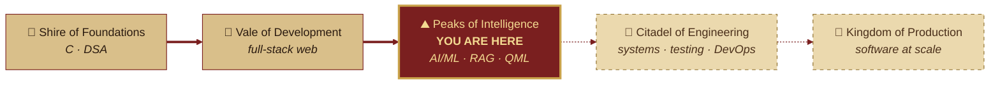

<div align="center">

```text
╔══╦════════════════════════════════════════════════╗
║░░║                                                ║
║▓▓║        .:*~*:._.:*~*:._.:*~*:._.:*~*:.         ║
║░░║                                                ║
║||║                  .-~~~~~~~~-.                  ║
║░░║                .'   .----.   '.                ║
║░░║               /   /  </>  \   \                ║
║▓▓║               |   |  ~~~~  |   |               ║
║░░║                \   \ ____ /   /                ║
║░░║                '.   '----'   .'                ║
║▓▓║                  '-~~~~~~~~-'                  ║
║░░║                                                ║
║||║      T H E    C H R O N I C L E S    O F       ║
║░░║                                                ║
║░░║      ▄███▄ ██ ██ █████ █████ ▄███▄ ██  █       ║
║▓▓║      ██    ██ ██ ██     ██   ██ ██ ███ █       ║
║░░║      ██    █████ ████   ██   █████ █ ███       ║
║░░║      ██    ██ ██ ██     ██   ██ ██ █  ██       ║
║▓▓║      ▀███▀ ██ ██ █████  ██   ██ ██ █   █       ║
║░░║                                                ║
║||║     ██ ██ ██ ██ █▄ ▄█ ▄███▄ ████▄    ▄███▄     ║
║░░║     ████  ██ ██ █▀█▀█ ██ ██ ██ ██    ██        ║
║░░║     ███   ██ ██ █ ▀ █ █████ ████▀    ██ ▄▄     ║
║▓▓║     ████  ██ ██ █   █ ██ ██ ██ █     ██  █     ║
║░░║     ██ ██ ▀███▀ █   █ ██ ██ ██  █    ▀███▀     ║
║░░║                                                ║
║▓▓║     ~  Code-Mage of the Southern Realm  ~      ║
║░░║    Software Eng.  .  Full-Stack  .  AI / ML    ║
║||║                                                ║
║░░║           -- Volume I  .  MMXXVI --            ║
║░░║                                                ║
║▓▓║        .:*~*:._.:*~*:._.:*~*:._.:*~*:.         ║
║░░║                                                ║
╚══╩════════════════════════════════════════════════╝
```

$$\color{#C9A24A}\mathfrak{The\ Chronicles\ of\ Chetan\ Kumar\ G}$$

*A true account of a young code-mage of the Southern Realm*

**[🏰 Visit the Tower](https://chetankumarg.tech)** &nbsp;·&nbsp; **[🕊️ Send a Raven](mailto:chetankumarg210307@gmail.com)** &nbsp;·&nbsp; **[⚔️ The Guild Hall](https://www.linkedin.com/in/chetan-kumar-g21/)** &nbsp;·&nbsp; **[📚 The Archive](https://github.com/Chetan-Kumar-G?tab=repositories)**

</div>

> [!IMPORTANT]
> **The mage seeks a guild.** Chetan is open to **Software Engineering, Full-Stack and AI/ML internships**, and would like to own real features from the first sketch to production.

<br />

<div align="center">

### ❦ &nbsp; C O N T E N T S &nbsp; ❦

| | | |
|:--|:--|--:|
| 📜 | [**Prologue**](#prologue) · *in which our hero is introduced* | i |
| 🧙 | [**Chapter I** · The Character Sheet](#character) | 1 |
| 🔮 | [**Chapter II** · The Spellbook](#spellbook) | 2 |
| ⚔️ | [**Chapter III** · The Quest Log](#quests) | 3 |
| 🗺️ | [**Chapter IV** · The Map of the Realm](#map) | 4 |
| 🕯️ | [**Chapter V** · The Code of the Mage](#code) | 5 |
| 🪶 | [**Epilogue** · Summon the Mage](#epilogue) | ∞ |

</div>

---

<a name="prologue"></a>

## 📜 Prologue

> ### 𝕴𝖓 𝖙𝖍𝖊 𝖘𝖔𝖚𝖙𝖍𝖊𝖗𝖓 𝖗𝖊𝖆𝖑𝖒 𝖔𝖋 𝕮𝖍𝖊𝖓𝖓𝖆𝖎,
>
> within the great halls of **Amrita Vishwa Vidyapeetham**, there studies a young code-mage named **Chetan Kumar G**.
>
> He first mastered the *Old Tongue* of **C** and the ancient art of **algorithms**. Then he crossed into the *Web Lands*, weaving interfaces from **HTML, CSS and JavaScript** and summoning servers with **Node**.
>
> In time he climbed toward the *Peaks of Intelligence*, where machines learn from data and old scriptures answer questions. There he built **RAG systems**, studied **quantum machine learning**, and taught satellites to spot oil on the open sea.
>
> His creed has never changed:
>
> &nbsp;&nbsp;&nbsp;&nbsp; ***build → test → break → debug → improve → repeat***
>
> And now he seeks a guild worthy of his craft.

---

<a name="character"></a>

<details open>
<summary><h2>🧙 Chapter I · The Character Sheet</h2></summary>

```text
┌────────────────────────────────────────────────────────┐
│  NAME ........ Chetan Kumar G                          │
│  CLASS ....... Code-Mage  (Full-Stack Engineer)        │
│  GUILD ....... Amrita Vishwa Vidyapeetham              │
│  REALM ....... Chennai, India                          │
│  LEVEL ....... B.Tech, Computer Science & Engg.        │
│  ALIGNMENT ... Lawful Builder                          │
│  QUEST ....... An SDE / Full-Stack / AI-ML             │
│                internship worthy of the craft          │
├────────────────────────────────────────────────────────┤
│  ATTRIBUTES                                            │
│                                                        │
│  INT  AI & Machine Learning   ████████████████░░░░     │
│  DEX  Front-End & UI Craft    ██████████████████░░     │
│  STR  Back-End & APIs         ██████████████░░░░░░     │
│  WIS  Algorithms & DSA in C   █████████████████░░░     │
│  CON  Debugging Stamina       ██████████████████░░     │
│  CHA  Design & Storytelling   █████████████████░░░     │
│                                                        │
│  SPECIAL ABILITY:  build > test > debug > repeat       │
└────────────────────────────────────────────────────────┘
```

<sub>*Attributes are the mage's own honest estimate, and they rise with every quest.*</sub>

</details>

---

<a name="spellbook"></a>

<details open>
<summary><h2>🔮 Chapter II · The Spellbook</h2></summary>

*Incantations mastered, and scrolls still being deciphered.*

| Rune | Spell | Tongue of Power | School of Magic |
|:--:|:--|:--|:--|
| 🐍 | *Serpent's Tongue* | **Python** | Scripting · Machine Learning · Automation |
| 📜 | *The Living Script* | **JavaScript** | The Web's own magic |
| 🗿 | *The Old Tongue* | **C** | Algorithms · Data Structures · Systems |
| 🧵 | *Weaving of Forms* | **HTML & CSS** | Layout · Responsive UI · Craft |
| ⚛️ | *Atom Binding* | **React** | Components · State · SPAs |
| 🔥 | *Server Summoning* | **Node.js** | REST APIs · Back-end |
| 🌿 | *Branches of Time* | **Git & GitHub** | Version control · Collaboration |
| 🐳 | *Vessel Binding* | **Docker** | Containers · Shipping |
| 👁️ | *Oracle's Sight* | **AI / ML · RAG** | Models · Retrieval · Quantum ML |

> [!NOTE]
> **Scrolls still being deciphered:** ☁️ *Cloud Walking* (**AWS**) · 🍃 *Leaf Archives* (**MongoDB**) · 🐘 *Elephant Tomes* (**PostgreSQL**)

</details>

---

<a name="quests"></a>

<details open>
<summary><h2>⚔️ Chapter III · The Quest Log</h2></summary>

| | Quest | The Legend | The Deed | Status |
|:--:|:--|:--|:--|:--:|
| **I** | [**FeastV**](https://github.com/Chetan-Kumar-G/FeastV) | *The Feast of Many Tables* | Food delivery and restaurant seat booking, woven into one web app | ✅ Complete |
| **II** | [**Algorithms in C**](https://github.com/Chetan-Kumar-G/Design-Analysis-and-Algorithms) | *Trials of the Old Tongue* | Design & Analysis of Algorithms: implementations and problem-solving in C | ✅ Complete |
| **III** | [**Flipkart UI**](https://github.com/Chetan-Kumar-G/Flipkart) | *The Merchant's Mirror* | An e-commerce interface recreated: grids, cards and responsive layout | ✅ Complete |
| **IV** | [**Amazon UI**](https://github.com/Chetan-Kumar-G/Amazon) | *The Endless Bazaar* | A front-end build inspired by a great e-commerce platform's product pages | ✅ Complete |
| **V** | **OceanGuard** | *Guardians of the Tide* | Oil-spill detection from satellite imagery, cross-checked with AIS ship data to find the vessel responsible · *Smart India Hackathon 2026* | ⏳ Underway |
| **VI** | **Sanatan AI** | *The Oracle of Scriptures* | An evidence-grounded RAG system answering questions from the Gita, Yoga Sutras and Upanishads · *Smart Amrita Hackathon 2026* | ⏳ Underway |
| **VII** | **Quantum Credit Risk** | *The Qubit Ledger* | A hybrid quantum-classical ML benchmark for credit risk on the UCI German Credit dataset · *Capstone* | ⏳ Underway |
| **VIII** | **Karigar** | *The Artisans' Road* | AI-driven market linkage and smart cataloguing for India's artisans · *Smart India Hackathon 2026* | ⏳ Underway |

</details>

---

<a name="map"></a>

<details>
<summary><h2>🗺️ Chapter IV · The Map of the Realm &nbsp;<sub><i>(click to unfold)</i></sub></h2></summary>

```text
  ~    ~     ~    ~     ~    ~     ~    ~     ~    ~      N
     ~    ~    ___________________________    ~      ~  W-+-E
  ~     ___.--'     /\      /\     /\     '--.___   ~     S
     .-'      /\   /  \    /  \   /  \  /\       '-.     ~
  ~ /        /  \_/    \__/    \_/    \/  \         \       ~
   |            PEAKS  OF  INTELLIGENCE              |  ~
 ~ |          AI . ML . RAG . QML                    |       ~
   |                  . . . (*) <-- YOU ARE HERE     |   ~
  /     VALE OF       .         :                    \
 |    DEVELOPMENT   .             :          |>      |  ~
 |    full-stack  (x)               :       [##]     |
 |    web       .      ~~~ river ~~~ :   CITADEL OF   |   ~
  \   ^  ^     .                         ENGINEERING  /
 ~ |  ^ ^ ^   .                           :     |>   |    ~
   |  ^ ^ (x) SHIRE OF                     :  [####] |
 ~  \       FOUNDATIONS              KINGDOM OF     /    ~
     \      C . DSA                  PRODUCTION   .'
  ~   '-.__                               ___.--'   ~     ~
     ~     '--.______________________.--''     ~      ~
  ~     ~     ~     ~     ~     ~     ~     ~     ~     ~

   (x) lands conquered    (*) you are here    : the road ahead

```

*The same road, as the royal cartographer drew it:*



</details>

---

<a name="code"></a>

<details open>
<summary><h2>🕯️ Chapter V · The Code of the Mage</h2></summary>

> **I.** &nbsp; Understand the problem before summoning a single line of code.<br/>
> **II.** &nbsp; Build it, then try hard to break it.<br/>
> **III.** &nbsp; Debug with evidence, never with guesses.<br/>
> **IV.** &nbsp; Leave every codebase clearer than you found it.<br/>
> **V.** &nbsp; Ship, learn, and begin again.

</details>

---

<a name="epilogue"></a>

## 🪶 Epilogue · Summon the Mage

> *To whichever guild is reading these pages,*
>
> If your team has need of a builder who is curious, careful and hungry to learn, I would be glad to join your quest.
>
> | | |
> |:--|:--|
> | 🕊️ **Send a raven** | [chetankumarg210307@gmail.com](mailto:chetankumarg210307@gmail.com) |
> | 🏰 **Visit the tower** | [chetankumarg.tech](https://chetankumarg.tech) |
> | ⚔️ **The guild hall** | [linkedin.com/in/chetan-kumar-g21](https://www.linkedin.com/in/chetan-kumar-g21/) |
> | 📚 **The archive** | [github.com/Chetan-Kumar-G](https://github.com/Chetan-Kumar-G) |
>
> *Sealed by my hand,*<br/>
> **C. K. G.**

<div align="center">

```text
      .:*~*:._.:*~*:._.  T H E   E N D  ._.:*~*:._.:*~*:.
              ...of Volume I. Volume II is being written.
```

</div>
