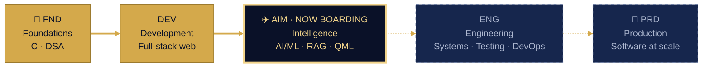
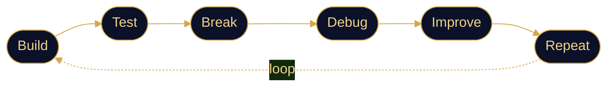

<!-- ═══════════════ DEVELOPER PASSPORT · CHETAN KUMAR G ═══════════════ -->

<div align="center">


<a href="https://github.com/Chetan-Kumar-G">
  
</a>

<a href="https://chetankumarg.tech"></a>
<a href="mailto:chetankumarg210307@gmail.com"></a>
<a href="https://www.linkedin.com/in/chetan-kumar-g21/"></a>


</div>

---

## 🛂 Data Page

<table>
<tr><td><b>Name</b></td><td>Chetan Kumar G</td></tr>
<tr><td><b>Profession</b></td><td>Software Engineer · Full-Stack Developer · AI/ML Explorer</td></tr>
<tr><td><b>Programme</b></td><td>B.Tech, Computer Science &amp; Engineering</td></tr>
<tr><td><b>Institution</b></td><td>Amrita Vishwa Vidyapeetham, Chennai</td></tr>
<tr><td><b>Operating system</b></td><td><code>build → test → break → debug → improve → repeat</code></td></tr>
<tr><td><b>Looking for</b></td><td>SDE / Full-Stack / AI-ML internships where I can own real features</td></tr>
<tr><td><b>Portfolio</b></td><td><a href="https://chetankumarg.tech">chetankumarg.tech</a></td></tr>
<tr><td><b>Contact</b></td><td><a href="mailto:chetankumarg210307@gmail.com">chetankumarg210307@gmail.com</a></td></tr>
</table>

```text
P<DEVG<<CHETAN<KUMAR<<<<<<<<<<<<<<<<<<<<<<<<
CKG2026SDE7DEV<OPEN<TO<INTERNSHIPS<<<<<<<<04
```

---

## ⭐ Why Hire Me

> **🚀 I ship end to end.** I take ideas from a blank page to a working product. [FeastV](https://github.com/Chetan-Kumar-G/FeastV) combines food ordering *and* restaurant seat booking in one app.

> **🧠 I work across the stack.** C and DSA fundamentals → JavaScript, React and Node.js on the web → Python for AI/ML (RAG pipelines, quantum ML).

> **⚡ I deliver under pressure.** I built hackathon solutions for **Smart India Hackathon 2026** (two problem statements) and **Smart Amrita Hackathon 2026**, on real problems like oil spills, artisans' livelihoods and trustworthy AI.

> **🔍 I debug before I guess.** I test, break and fix my own code before anyone else has to.

<div align="center">


</div>

---

## 🛃 Visas · Tech Stack

<div align="center">

**Granted · daily drivers**


**Pending · currently exploring**


</div>

---

## 🎫 Boarding Passes · Projects

### Shipped

> ### [FeastV](https://github.com/Chetan-Kumar-G/FeastV) &nbsp;`HGR ✈ FST` · hungry → feasted
> Food delivery + restaurant seat booking, stitched into one seamless web app.
>
>    

> ### [Design & Analysis of Algorithms](https://github.com/Chetan-Kumar-G/Design-Analysis-and-Algorithms) &nbsp;`BRT ✈ OPT` · brute force → optimal
> Algorithm implementations and problem-solving practice in C.
>
>   

> ### [Flipkart UI](https://github.com/Chetan-Kumar-G/Flipkart) &nbsp;`FIG ✈ PXL` · mockup → pixel-perfect
> E-commerce interface recreation: grids, cards and responsive layout.
>
>   

> ### [Amazon UI](https://github.com/Chetan-Kumar-G/Amazon) &nbsp;`DOM ✈ CRT` · browse → cart
> Front-end build inspired by a major e-commerce platform's product UI.
>
>   

### In Flight

> ### OceanGuard &nbsp;`SAT ✈ SEA` · satellite → safe seas
> Oil-spill detection from satellite imagery, correlated with AIS data to flag the responsible vessel.
>
>   

> ### Sanatan AI &nbsp;`SLK ✈ ANS` · scripture → answers
> Evidence-grounded RAG system over the Bhagavad Gita, Yoga Sutras and Upanishads.
>
>   

> ### Quantum Credit Risk &nbsp;`QBT ✈ RSK` · qubits → risk score
> Hybrid quantum-classical ML benchmark for credit risk on the UCI German Credit dataset.
>
>   

> ### Karigar &nbsp;`ART ✈ MKT` · artisan → market
> AI-driven market linkage and smart cataloguing app for India's artisans.
>
>   

---

## ✈️ Flight Log · Roadmap



### Standard Operating Procedure



---

## 🧾 Customs Declaration · Live Stats

<div align="center">


</div>

---

<div align="center">

### 🛬 Arrivals

*If found, please return this passport to the nearest **engineering team**.*

<a href="https://chetankumarg.tech"></a>
<a href="mailto:chetankumarg210307@gmail.com"></a>
<a href="https://www.linkedin.com/in/chetan-kumar-g21/"></a>


</div>
